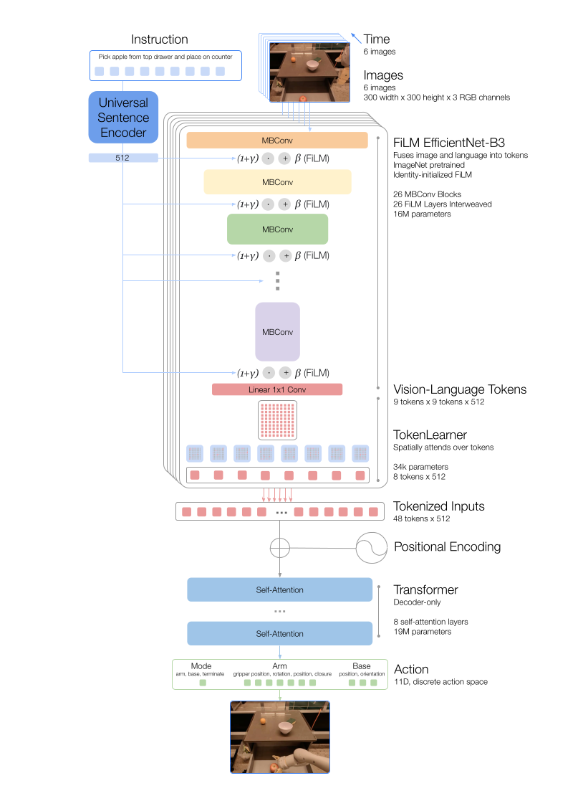

Model Inputs and Outputs: 
* Inputs: Text instructions and an image. A network called FiLM fuses text and image tokens, with image tokens generated based on ImageNet, which is more like feature representation learning, unlike RT2, which uses a ViT transformer-structure network to generate image tokens.
  
* Outputs: Low-level actions related the robot's arm's pose, base pose, and action mode. Each action falls into one of 256 dimension discrete bins.

Model Training:

* The model was pretrained from scratch on transformers structure, not fine-tuning a language model (please correct me if I'm wrong).

* The approach can hardly be viewed as reinforcement learning, since there is no reward feedback to backpropagate the policy network (the transformer structure). It is imitation learning - all samples are treated as good samples with positive rewards, and the network simply learns to replicate the demonstrated correct actions.

Instruction Datasets:

* A massive dataset provides text instructions and desirable action samples for each robot.
* Drawbacks are apparent. We will need to obtain a large vision-language-action dataset for each robot. Without automatic reinforcement learning utilizing both positive and negative rewards as feedback, such a large dataset might be necessary. But autonomous AI can ideally generate its own reward functions based on the task-context, thus achieve autonomous training on its own without giving any demonstrations from imitation learning. The ability to understand and generate the reward functions are essential. 
* Moreover, it can decompose long-horizon tasks into small ones, like SayCan.

Inference Speed:
* This paper's 1B parameter model takes around 1.9 seconds to generate an action, which is likely acceptable. It can hardly load the model onto the physical robot, thus deploying the LLM model in the cloud and use network service is a pratical choice. 